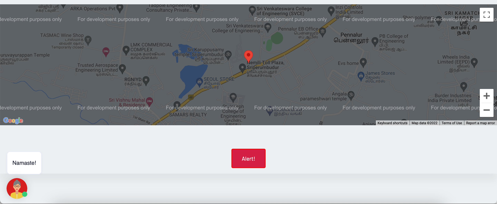
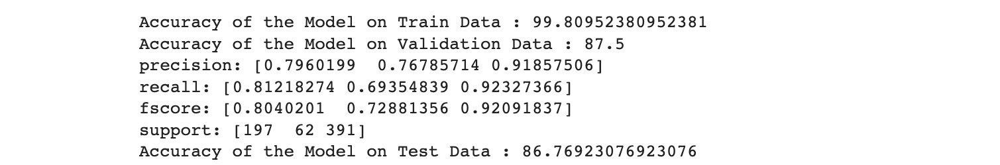

# BOLO
### Be on LookOut
 
Safety isn't expensive, it's priceless. Gender equality is not only a fundamental human right, but a necessary foundation for a peaceful, prosperous and sustainable world. Our platform BOLO(Be on lookout), currently under construction is a web based platform which aims to make India a safer and better place for women because new India's growth isn't possible without ensuring women's security.
 

Our star feature is the alert feature(in progress) when clicked on the help button, that essentially alerts helpline authorities and your registered emergency contacts about your current location with a red alert.
 

and a help bot for other help like finding the nearest police stations, washrooms, locating the safest route to your destination etc.

Alongside we also present a flagship product called Bolo+, which is an NLP(Natural Language Processing) based addon that detects and cleanses abuse on social media in hinglish. The dataset for this was taken from previously scraped tweets. 

### Future Prospects
- Our aim is to deploy the ML model as an extention or bot of sort to clear out the abusive tweets on the platform.
- Furthur we also plan on adding a blog section and education section on our web interface for women.

### Contributors

